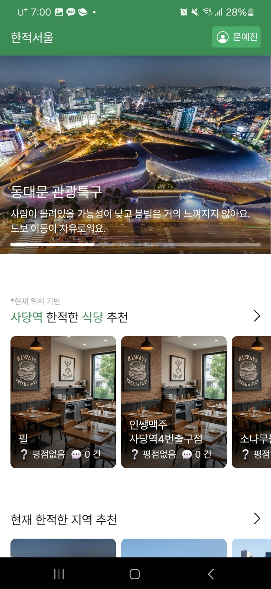
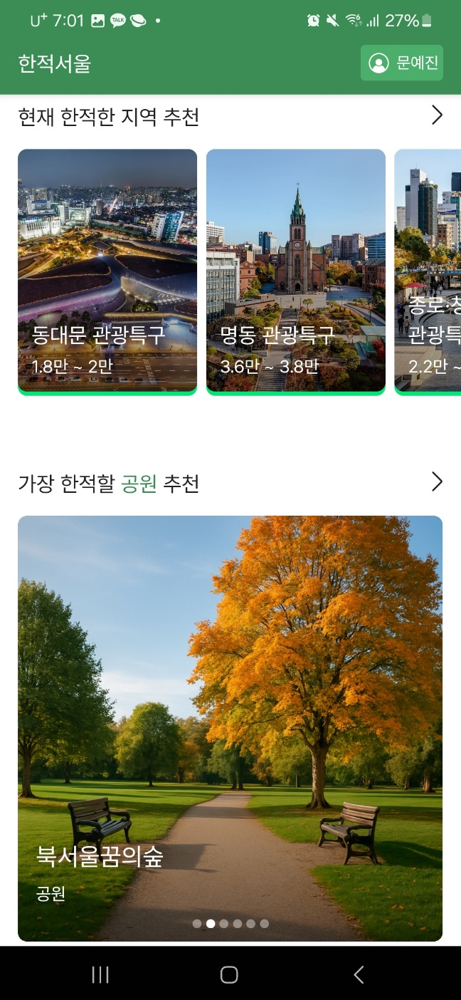
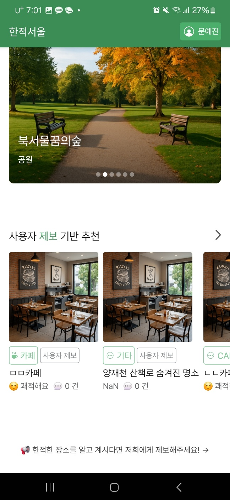
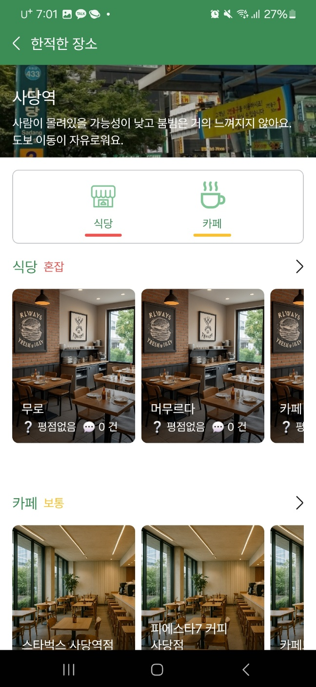
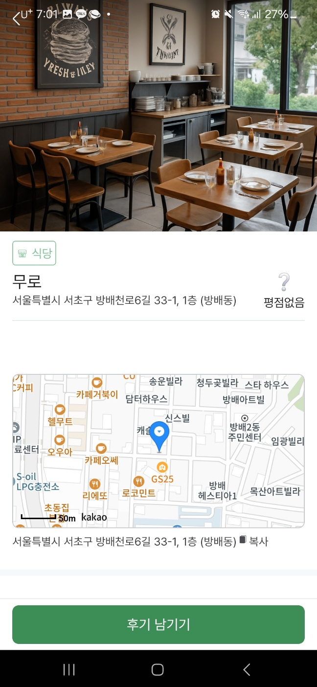
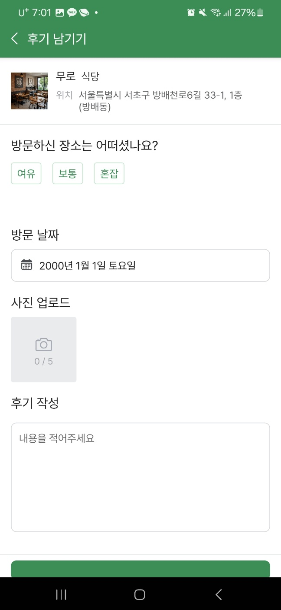
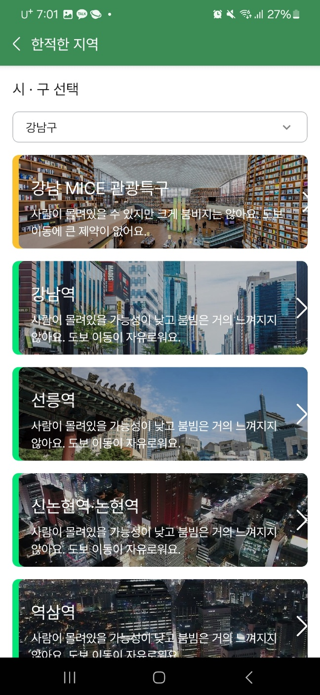
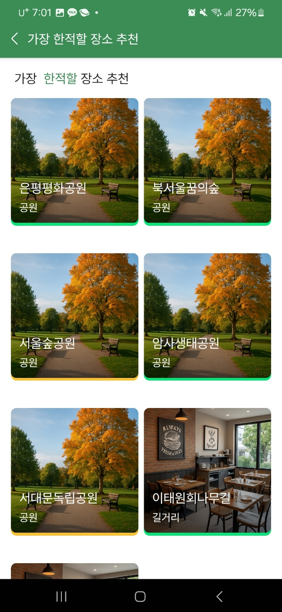
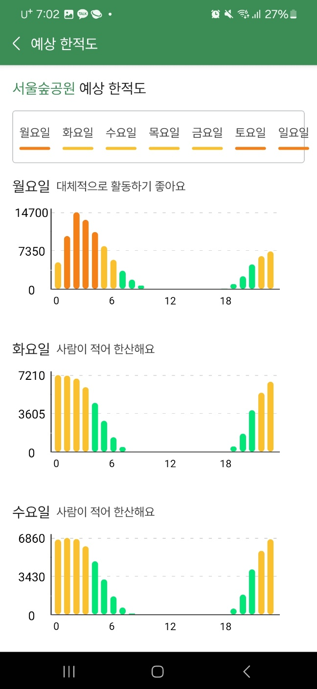

# 🌿 한적서울 (QuietSeoul)

> "서울 도심 속, 한적한 쉼표를 찾아드립니다."

실시간 인구 밀집도 데이터를 기반으로, 사용자 위치 주변의 덜 붐비는 장소(식당, 카페, 공원)를 추천하는 모바일 서비스입니다.  
공공데이터와 사용자 리뷰를 결합한 커뮤니티 기반 추천 시스템으로, 조용한 장소를 찾고 싶은 사용자들의 감성적 니즈를 기술적으로 해결했습니다.

---

## 🔍 프로젝트 개요

- **개발 기간**: 2025.03 ~ 2025.05  
- **참여 인원**: 4명 (백엔드 2, 프론트 1, 데이터 1)  
- **담당 역할**: 기획, 백엔드 전반 설계 및 핵심 기능 구현 주도
- **성과**: 서울시 공공데이터 활용 경진대회 본선 진출 / Google Play 앱 출시 완료

---

## 🌟 주요 기능

- **위치 기반 장소 추천**:  
  사용자 좌표와 116개 기준 지역 간의 거리를 계산하여, 가장 가까운 지역 내 혼잡도가 낮은 장소를 추천합니다.

- **커뮤니티 제보 및 후기 흐름**:  
  사용자가 장소를 제보하고, 관리자의 승인을 거쳐 리뷰와 사진을 등록하는 커뮤니티 구조를 제공합니다.

- **이미지 업로드 처리**:  
  리뷰 이미지 파일을 AWS S3에 저장하고, 접근 가능한 URL을 DB에 연동합니다ㅁ.

- **JWT 인증 및 마이페이지**:  
  회원가입, 로그인, 내 리뷰 확인 등 사용자 인증 및 개인정보 기반 API를 구현했습니다.

- **CI/CD 및 HTTPS 대응**:  
  GitHub Actions, Docker, EC2 기반 자동 배포 파이프라인을 구축하고, HTTPS 대응을 위해 Render로 전환 배포를 수행했습니다.

---

## 🛠 기술 스택

| 구분 | 스택 |
|------|------|
| **Backend** | Spring Boot, JPA, MySQL, JWT, Swagger |
| **Infra / DevOps** | AWS EC2, S3, Docker, GitHub Actions, Render |
| **Frontend (협업)** | React Native (Expo Router) |
| **Data** | Python, Pandas (CSV → DB 삽입, EPSG 좌표계 변환) |

---

## 🧩 아키텍처 구성

```plaintext
[React Native App]
        ↓
API 요청 (JWT 인증 포함)
        ↓
Spring Boot Backend
  ├── 위치 기반 추천 로직
  ├── 장소/제보/리뷰 CRUD API
  └── 이미지 업로드 → AWS S3 연동
        ↓
MySQL (RDS) / Swagger 문서화
        ↓
Python 전처리 (CSV 삽입, TM → WGS84 변환)
        ↓
서울시 실시간 인구 API + 사용자 리뷰 데이터 기반 추천
```

## 📸 주요 화면 미리보기

---

### 🏠 메인 홈 화면

<table>
  <tr>
    <td align="center"><b>위치 기반 추천</b></td>
    <td align="center"><b>한적한 지역, 한적할 공원 추천</b></td>
    <td align="center"><b>사용자 제보 기반 추천</b></td>
  </tr>
  <tr>
    <td></td>
    <td></td>
    <td></td>
  </tr>
</table>

---

### 📍 내 주변 한적한 장소

<table>
  <tr>
    <td align="center"><b>혼잡도 및 리스트 화면</b></td>
    <td align="center"><b>장소 상세 정보</b></td>
  </tr>
  <tr>
    <td></td>
    <td></td>
  </tr>
</table>

---

### 🧾 사용자 후기 작성

<table>
  <tr>
    <td align="center"><b>후기 등록 화면</b></td>
  </tr>
  <tr>
    <td align="center"></td>
  </tr>
</table>

---

### 🗺 한적한 지역 구 선택

<table>
  <tr>
    <td align="center"><b>지역 선택 화면</b></td>
  </tr>
  <tr>
    <td align="center"></td>
  </tr>
</table>

---

### 🌳 공원 추천 및 예상 혼잡도

<table>
  <tr>
    <td align="center"><b>공원 리스트</b></td>
    <td align="center"><b>혼잡도 분석</b></td>
  </tr>
  <tr>
    <td></td>
    <td></td>
  </tr>
</table>


## 🙋‍♀️ 주요 기여 (백엔드)

백엔드는 2인이 협업하였으며, 저는 시스템 아키텍처 설계, 배포 인프라 구성, 주요 API 및 추천 알고리즘 개발을 주도했습니다.

- **DB 및 시스템 구조 설계**  
  - `Place`, `Area`, `User`, `Review`, `Suggestion` 엔티티 모델링 및 정규화  
  - 정적 장소 데이터 + 사용자 리뷰/혼잡도 데이터를 통합 설계

- **위치 기반 추천 알고리즘 구현**  
  - 사용자 좌표 ↔ 서울시 기준 지역(80여곳) 간 거리 계산  
  - 실시간 인구 데이터 기반 + 카테고리(식당/카페/공원) 필터링 알고리즘 개발

- **제보 커뮤니티 흐름 및 이미지 업로드 처리**  
  - 제보 등록 → 관리자 승인 → 리뷰 → 이미지 업로드 전 과정 설계 및 구현  
  - 멀티파트 이미지 S3 업로드 + URL DB 연동, 기본 이미지 fallback 로직 구현

- **CI/CD 및 HTTPS 대응**  
  - GitHub Actions + Docker + EC2 기반 자동 배포 구성  
  - 앱 HTTPS 대응을 위해 Render 전환 및 SSL 인증 자동화

- **API 문서화 및 프론트 협업 최적화**  
  - Swagger 기반 전체 API 명세서 작성  
  - 응답 포맷 통일, 예외 메시지 개선, 환경설정 가이드 제공

- **Expo 빌드 이슈 분석 및 해결 주도**  
  - 공모전 마감 직전 Android 빌드 실패 문제 대응  
  - SDK 충돌, 환경변수 누락, fallback 처리 문제 디버깅 및 수정


---

## 📫 연락처

**문예진 | Backend Developer**  
사용자 중심의 확장 가능한 시스템을 고민하고, 문제를 끝까지 책임지는 개발자입니다.

- ✉️ Email: i0209i80@gmail.com  
- 📱 Google Play: 앱 심사 중
