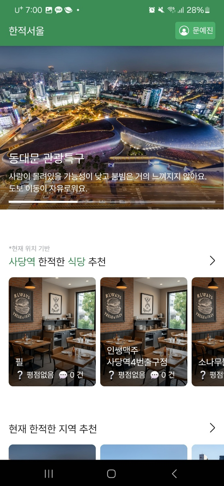
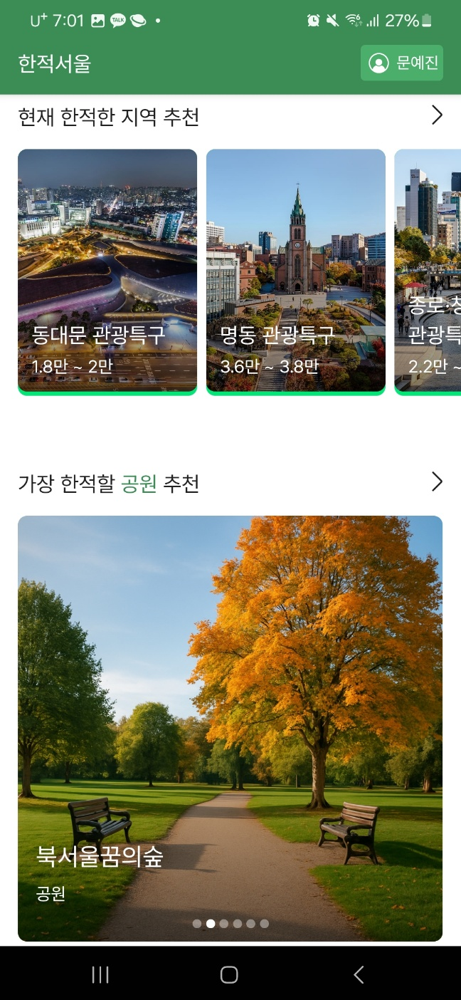
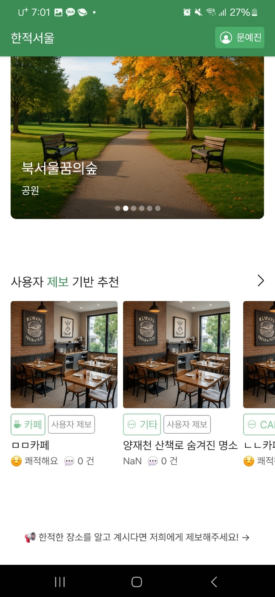
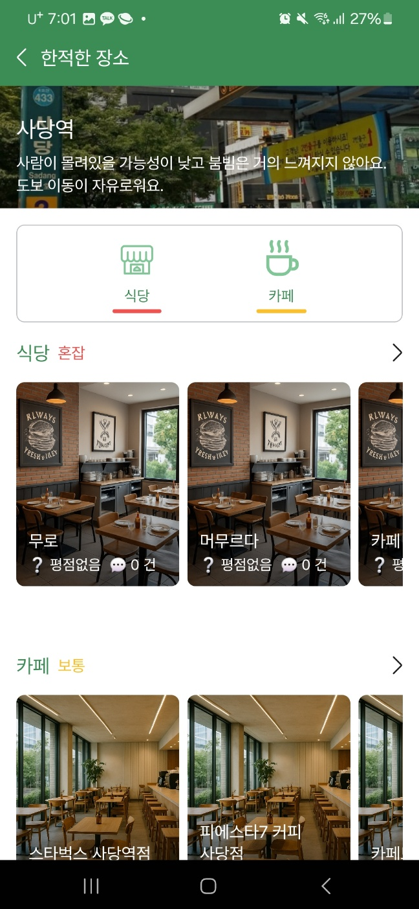
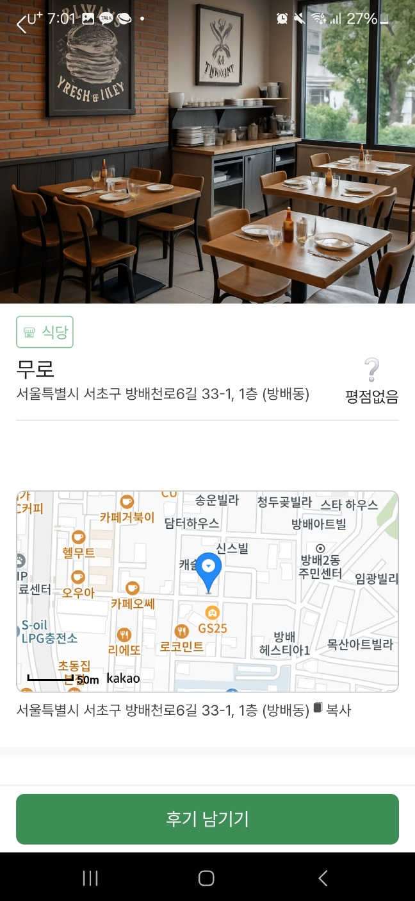
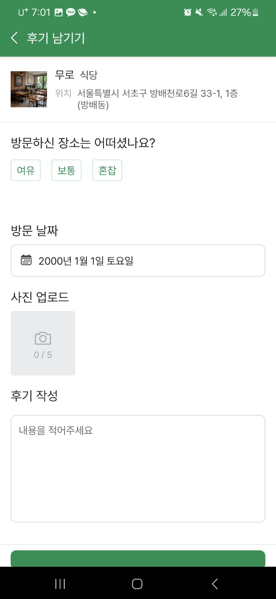
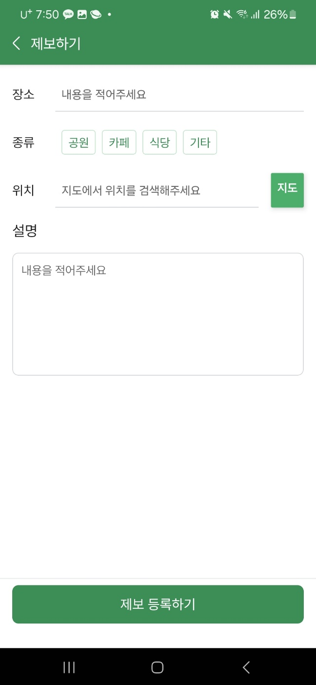
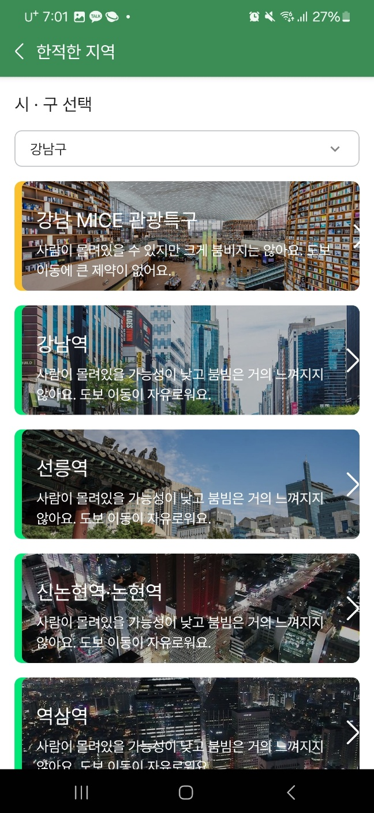
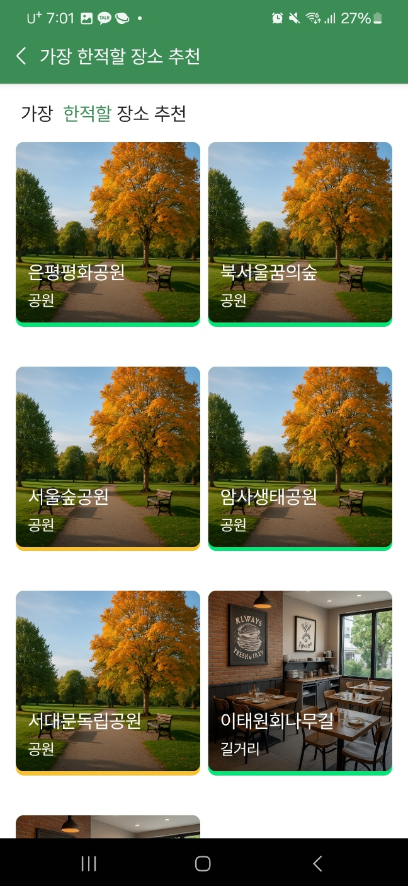
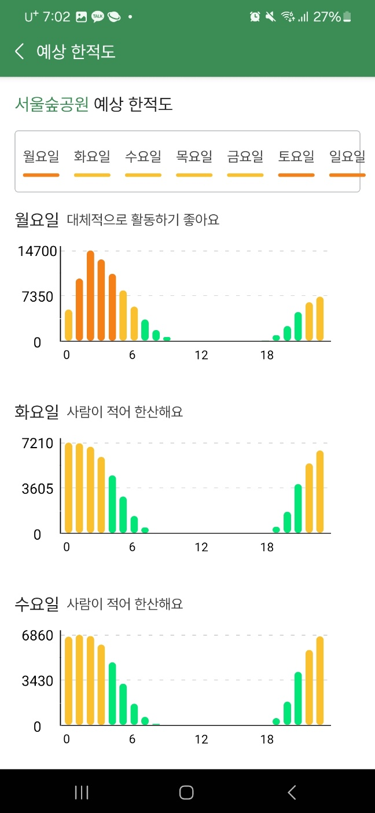

## 📸 주요 화면 미리보기

---

### 🏠 메인 홈 화면

<table>
  <tr>
    <td align="center"><b>위치 기반 추천</b></td>
    <td align="center"><b>한적한 지역, 한적할 공원 추천</b></td>
    <td align="center"><b>사용자 제보 기반 추천</b></td>
  </tr>
  <tr>
    <td></td>
    <td></td>
    <td></td>
  </tr>
</table>

---

### 📍 내 주변 한적한 장소

<table>
  <tr>
    <td align="center"><b>혼잡도 및 리스트 화면</b></td>
    <td align="center"><b>장소 상세 정보</b></td>
  </tr>
  <tr>
    <td></td>
    <td></td>
  </tr>
</table>

---

### 🧾 사용자 작성

<table>
  <tr>
    <td align="center"><b>후기 등록 화면</b></td>
    <td align="center"><b>제보하기 화면</b></td>
  </tr>
  <tr>
    <td align="center"></td>
    <td align="center"></td>
  </tr>
</table>

---

### 🗺 한적한 지역 구 선택

<table>
  <tr>
    <td align="center"><b>지역 선택 화면</b></td>
  </tr>
  <tr>
    <td align="center"></td>
  </tr>
</table>

---

### 🌳 공원 추천 및 예상 혼잡도

<table>
  <tr>
    <td align="center"><b>공원 리스트</b></td>
    <td align="center"><b>혼잡도 분석</b></td>
  </tr>
  <tr>
    <td></td>
    <td></td>
  </tr>
</table>

